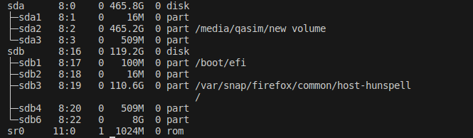

Last month, I was playing around with configuration files of my OS (ubuntu) and got myself into a login-loop, in simple words I couldn't login into my OS anymore.

<!--more-->
I tried almost every possible solution on the internet but couldn't fix it, so I replaced the OS with a new one and lost all my data.

After that I decided to backup my SSD (primary storage) data into HDD (secondary storage). In the following, I will show you how one can go about it

If the secondary storage is not mounted then we have to mount it first, we can get list of the all block devices attached to the machine by using `lsblk`. In my case, HDD is `sda`




We can now mount the hdd using `mount`, mounting is making storage device's file system accessible to OS and users. We will first create the mounting point (endpoint in the primary file system where storage device will be mounted) using `mkdir`. Then we will mount the hdd inside the created directory.

```bash
mkdir /media/qasim

sudo mount /dev/sda  /media/qasim
```
Now comes the main part, we will use `rsync` for backuping the data from home directory to the hdd. `new volume` is the name of mounted device. _Don't forget to add `/` at the end of source and destination_.

```bash
rsync -ra "/home/qasim/" "/media/qasim/new volume/backup/"
```

This command will create a backup of all the contents inside the `/home/qasim` to `/media/qasim/new volume/backup`, `r` stands for recursive, it means all the directories along with their subdirectories and files will be included. `a` tell rsync to do the incremental backup, so let's say that we backuped the entire ssd and now added a new file in source dir, should it should backup the whole thing again? that's where `a` comes in, it only backups the difference in the source and destination dir.

There are some other flags that we can use, i.e. `z`, it will compress the data while transferring from source to destination but it will be stored in uncompressed form in destination, it helps in speeding up the transfer. `v` stands for verbose, it instructs the program to provide more detailed output during its execution, in our case it will output the files which are accessed, bytes transferred, transfer rate etc. However, in our case as the number of files will be large so it's better to not use it. Right now our command looks like this

```bash
rsync -raz "/home/qasim/" "/media/qasim/new volume/backup"
```
There's one more thing we should add, the `delete` flag. It tells rsync to delete all the files in the destination dir if they're not present (removed after previous backup) in the source dir.

```bash
rsync -raz --delete "/home/qasim/" "/media/qasim/new volume/backup"
```
To check whether the backup was success ful or not, we can use the following `if else` statments, `$?` stores the exist status of last excuted commnad , `-eq` is used for equality. Exist status of a program is zero if it's executed successfully else it's non-zero. We can put everything into a single bash file.


```bash
#backup.sh

#!/bin/bash
rsync -raz --delete "/home/qasim/" "/media/qasim/new volume/backup"

if [ $? -eq 0 ]; then
   echo "backup successful"
else
  echo "backup unsuccessful"
fi

```


Last part is to scheduled the backup periodically, for this we will use the `cron` scheduler. Open crone tab using the command `crontab -e` and provide the schedule and file you want to run. Line below will run the backup.sh file each day at 2 am.

```bash
0 2 * * * /home/qasim/backup.sh
```

Finally, we're done with incrementaly backuping up our primary storage and now we can freely meddle with config files.


