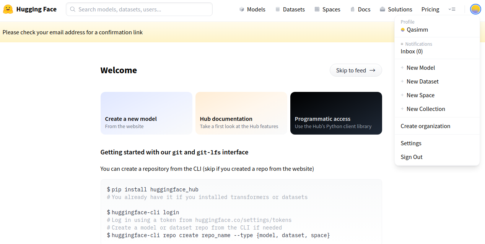
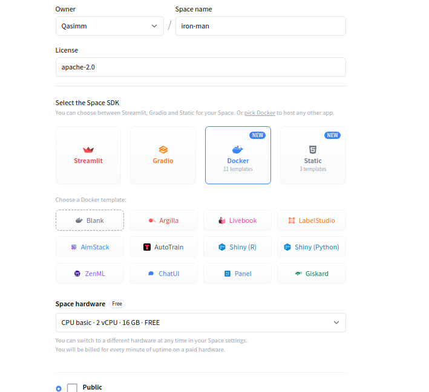
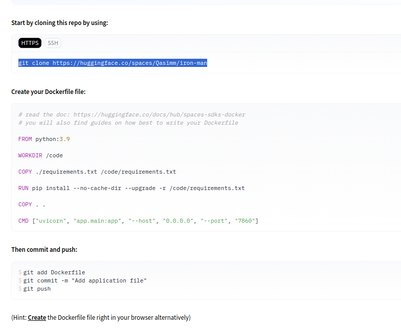
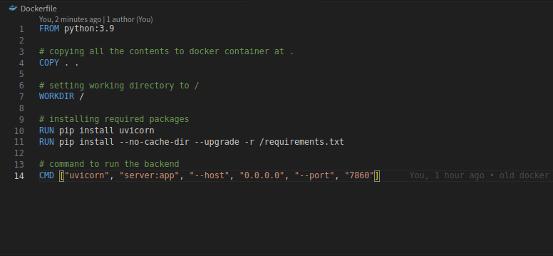
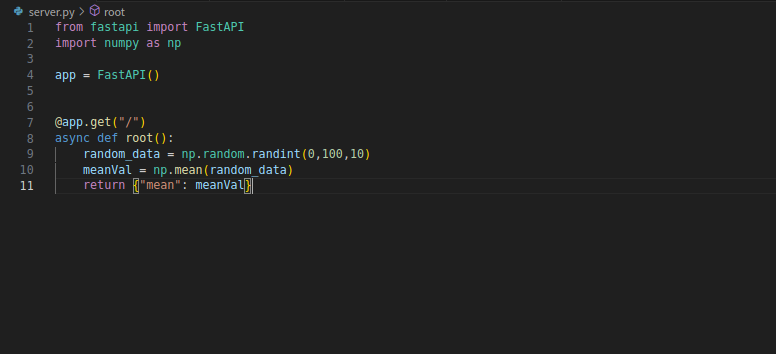
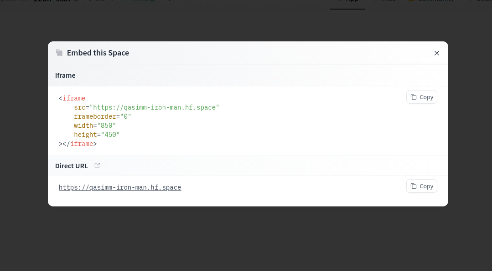

### Pre-requisites:
Basic undertstanding of **Git**.
You can follow [this](https://www.freecodecamp.org/news/introduction-to-git-and-github/) article to get familiar.
<!--more-->

### Article:

You can start by ceating an account on hugging face, after that click `new space` from the profile dropdown.



Space is just a fancy name for a remote git repositry, similar to Github repo.

Add your space name, for liscence I am going with apache, you may have a different choice.

Hugging Face comes with life time free-tier of 2 core virtual CPU and 16 GB of RAM, which is enough for simple applications but if you need more hardware, you can select one of their paid plans.

For Software Development Kit (SDK), I generally go with docker with `blank` template, you can select whatever you prefer.

You can also select the visibilty of your space according to your preferencce, public essentionaly means that everyone can view your space just like public Github repo and vice versa.





After adding all the information, click `create space`.

I know I am mentioning Github alot but that's because it's more popular and people are more familiar with it. It's completey fine if you don't know about it.

After that you will be dispalyed with page containing instructions on how you can setup the space.




Paste the first command in your terminal to clone remote repo locally.


Generate a requirements.txt file using `pip freeze > requirements.txt`, which will list all of your project's dependencies in a file named requirements.txt. `Pip freeze` also add unused packages to the file which are installed automatically along with your required package installation. You can go with [pipreqs](https://github.com/bndr/pipreqs) if you want a more clean version of the requirement.txt. 

Now add `Dockerfile` which will create a docker image. You can use one provided by hugging face or the one below.



Lastly, add your FastApi application, I made a dummy project for this blog which creates a random array using numpy and return the mean of it.



Now it's time to push changes to the remote repo using following instructions. 

```
git add .
git commit -a -m "<your commit msg>"
git push

```

For push, it will ask you for hugging face username and password either on termianl or by a prompt in your code editor. Hugging face now accepts tokens for authentication instead of passwords to improve security, you can generate one (write token) by going [here](https:/huggingface.co/settings/tokens) and use this token instead of password.

After you pushed all the changes, wait for it to build, which is to create an optimize compact version of your app. If everthing goes well you'll see a Running signal on your screen.

You can get the link to your api by clicking `Embed this space` from the dropdown and integrate it anywhere using `iframe` or `direct URL`.



That's how you deploy your FastApi to Hugging Face.


